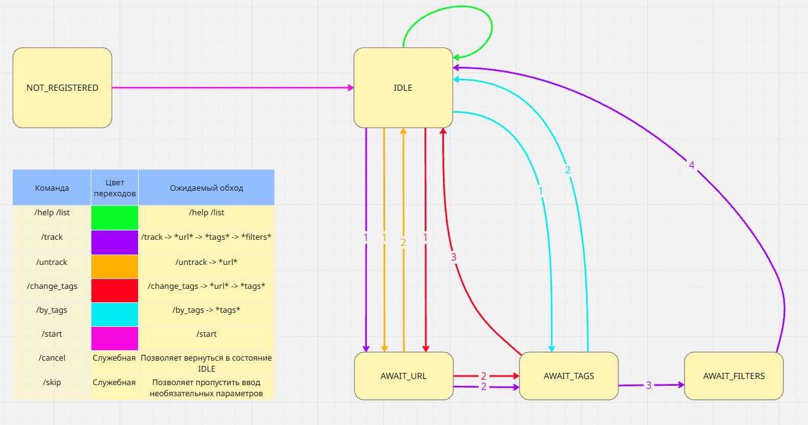

# Link Tracker

<!-- этот файл можно и нужно менять -->

Проект сделан в рамках курса Академия Бэкенда. Написал Сторожев Юрий Игоревич.

Приложение для отслеживания обновлений контента по ссылкам.
При появлении новых событий отправляется уведомление в Telegram.

Проект написан на `Java 23` с использованием `Spring Boot 3`.

Проект состоит из 2-х приложений:
* Bot
* Scrapper

Для работы требуется БД `PostgreSQL`. Присутствует опциональная зависимость на `Kafka`.

На данный момент проект можно запустить запустив приложения bot и scrapper в IDEA.
Чтобы опробовать бота в telegram создайтe .env в корне проекта, указав:

```cmd
TELEGRAM_TOKEN=your_telegram_token
GITHUB_TOKEN=your_github_token
SO_TOKEN_KEY=your_stackoverflow_token
```

Для дополнительной справки: [HELP.md](./HELP.md)

## Схемы

### Компоненты Bot’а

<div align="center">


<br/>
<em>Рис. 1. Конечный автомат (FSM) команд бота</em>

</div>

<div align="center">


<br/>
<em>Рис. 2. Получение и хранение контекста диалога</em>

</div>

### Компоненты Scrapper’а

<div align="center">


<br/>
<em>Рис. 3. ER-диаграмма базы данных ссылок</em>

</div>

<div align="center">


<br/>
<em>Рис. 4. Слой доступа и адаптеры к данным</em>

</div>

<div align="center">


<br/>
<em>Рис. 5. Поток обновлений (tracker) Scrapper’а</em>

</div>

