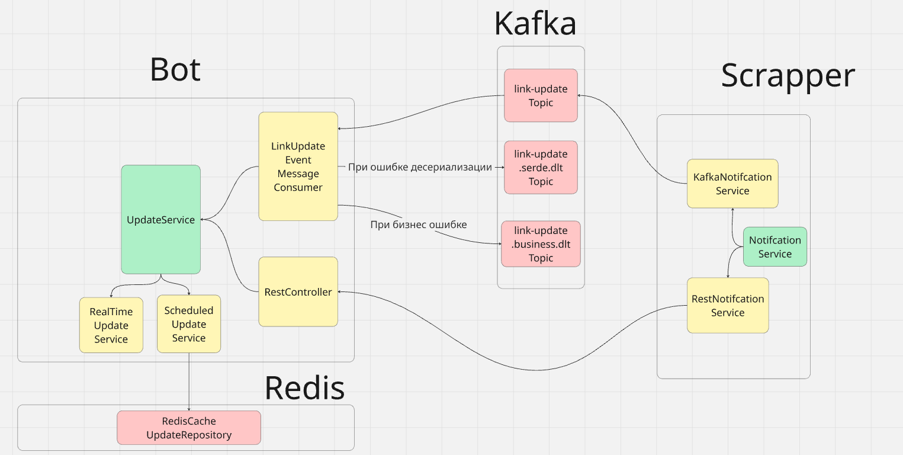

# Link Tracker

Проект сделан в рамках курса Академия Бэкенда. Написал Сторожев Юрий Игоревич.

Приложение для отслеживания обновлений контента по ссылкам.
При появлении новых событий отправляется уведомление в Telegram.

Проект написан на `Java 23` с использованием `Spring Boot 3`.

Проект состоит из 2-х приложений:
* Bot
* Scrapper

Notes:
- 22.08.2025. На данный момент проект перерабатывается:
    - Первая стадия:
        - Заменить maven на gradle
        - Сделать более проcтым для расширения fsm. Как вариант, перевести fsm на generic. 
        - Почистить репозиторий)
        - Добавить более грамотные логи
    - Вторая стадия:
        - Добавить DockerFile для обоих приложений
        - Добавить Prometheus + Grafana
        - Увеличить надёжность с помощью CircuitBreaker. 

## Схемы

### Приложение

 
<em>Рис. 1. Архитектура приложения</em>

### Компоненты Bot’а

 
<em>Рис. 2. Конечный автомат (FSM) команд бота</em>

 
<em>Рис. 3. Работа с FSM</em>

 
<em>Рис. 4. Получение и хранение контекста диалога</em>

### Компоненты Scrapper’а

 
<em>Рис. 5. ER-диаграмма базы данных ссылок</em>

 
<em>Рис. 5. Слой доступа и адаптеры к данным</em>

 
<em>Рис. 6. Поток обновлений (tracker) Scrapper’а</em>

